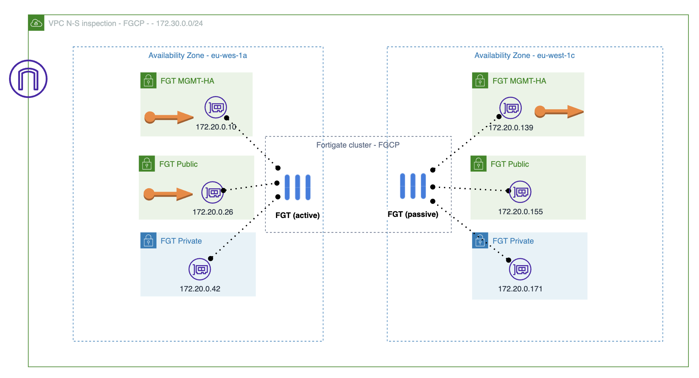

# Forigate cluster deployment in 2 AZ with 1 cluster as SDWAN spoke other as HUB
## Introduction

This deployment will establish a comprehensive SDWAN environment consisting of a HUB and a spoke. The spoke will consist of an active-active Fortigate Cluster (FGSP) deployed within a Virtual Private Cloud (VPC), where traffic will be forwarded from the VPC spoke to a Transit Gateway (TGW). The cluster will serve as the backend for a Gateway Load Balancer (GWLB), and endpoints will be deployed in the VPC to handle traffic from the TGW. The HUB cluster will be deployed in a separate VPC, configured as an FGCP cluster, and IPSEC tunnels will be established over the Internet.

## Requirements
* [Terraform](https://learn.hashicorp.com/terraform/getting-started/install.html) >= 1.0.0
* Check particulars requiriments for each deployment (AWS) 

## Deployment Overview

- New VPC with subnets in each AZ: Management (MGMT), Public, Private, Bastion, TGW and GWLB. (Only MGMT, Public and Private are needed for this setting).
- Fortigate cluster: 2 instances with 3 insterfaces each one and 2 EIP for management associated to MGMT interface and 1 EIP associated to active public interface.
- Bastion linux instance.

## Diagram overview

## Deployment
* Clone the repository.
* Configure accesss secrets to access AWS in terraform.tfvars.example which is allocated in root folder. [fgt-ha-1az_onramp](https://github.com/jmvigueras/modules/tree/main/aws/examples/fgt-ha-1az_onramp).  And rename `terraform.tfvars.example` to `terraform.tfvars`.
* Change parameters in the variables.tf.
* If using SSO, uncomment the token variable in variables.tf and providers.tf
* Initialize the providers and modules in each individual deployment as is described in it README file.

# Support
This a personal repository with goal of testing and demo Fortinet solutions on the Cloud. No support is provided and must be used by your own responsability. Cloud Providers will charge for this deployments, please take it in count before proceed.

## License
Based on Fortinet repositories with original [License](https://github.com/fortinet/fortigate-terraform-deploy/blob/master/LICENSE) © Fortinet Technologies. All rights reserved.

