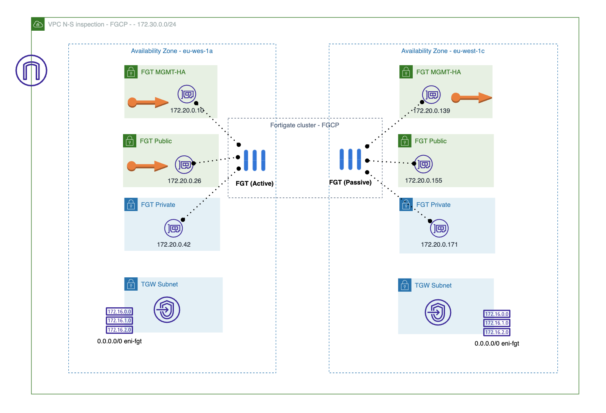

# Forigate cluster deployment in 2 AZ
## Introduction

This deployment will create a Fortigate Cluster Active/Passive in two Availabitly Zone (AZ)

## Deployment Overview

- New VPC with subnets in each AZ: Management (MGMT), Public, Private, Bastion, TGW and GWLB. (Only MGMT, Public and Private are needed for this setting).
- Fortigate cluster: 2 instances with 3 insterfaces each one and 2 EIP for management associated to MGMT interface and 1 EIP associated to active public interface.
- AWS TGW with 3 route tables: RT_spoke, RT_N-S_inspection and RT_E-W_inspection (only RT_spoke and N-S is needed for this setting)
- 2 spoke VPCs attached to TGW and associated to RouteTable RT_spoke 
- Bastion linux instance in VPC spokes

## Diagram overview

- VPC inspection

- TGW details

- Full diagram

## Requirements
* [Terraform](https://learn.hashicorp.com/terraform/getting-started/install.html) >= 1.0.0
* Check particulars requiriments for each deployment (AWS) 

## Deployment
* Clone the repository.
* Configure accesss secrets to access AWS in terraform.tfvars.example which is allocated in root folder. [fgt-ha-1az_onramp](https://github.com/jmvigueras/modules/tree/main/aws/examples/fgt-ha-1az_onramp).  And rename `terraform.tfvars.example` to `terraform.tfvars`.
* Change parameters in the variables.tf.
* If using SSO, uncomment the token variable in variables.tf and providers.tf
* Initialize the providers and modules in each individual deployment as is described in it README file.

# Support
This a personal repository with goal of testing and demo Fortinet solutions on the Cloud. No support is provided and must be used by your own responsability. Cloud Providers will charge for this deployments, please take it in count before proceed.

## License
[License](./LICENSE)

