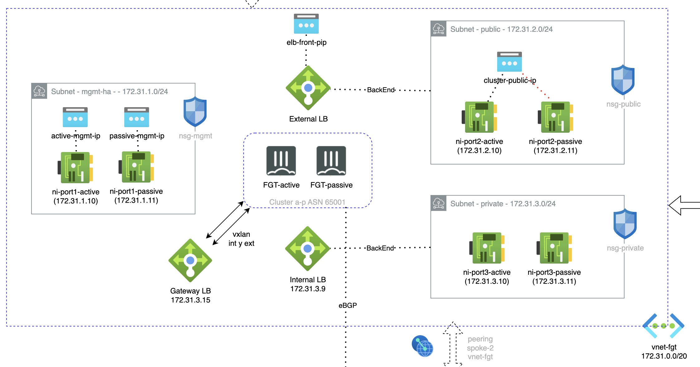

# Forigate cluster deployment with 4 ports
## Introduction

This deployment will create a Fortigate Cluster Active/Passive in two zones and with 4 ports (Management, Public, Private and HA). (This type of deployment using 4 ports must be used for versions less that 7.0.0, where a dedicated port for HA is mandatory)

## Deployment Overview

- New VNet with necessary subents: Management (MGMT), Public, Private and HA
- Fortigate cluster: 2 instances with 4 interfaces in active-passive cluster FGCP.
- Load Balancer (LB) sandwich deployment, one LB for frontend and another for backend communications.
- Gateway Load Balancer is optional to deploy. 

## Diagram overview

## Requirements
* [Terraform](https://learn.hashicorp.com/terraform/getting-started/install.html) >= 1.0.0
* Check particulars requiriments for each deployment (Azure) 

## Deployment
* Clone the repository.
* Configure accesss secrets to access Azure in terraform.tfvars.example which is allocated in root folder. [fgt-ha_4ports_onramp_xlb](https://github.com/jmvigueras/modules/tree/main/azure/examples/fgt-ha_4ports_onramp_xlb).  And rename `terraform.tfvars.example` to `terraform.tfvars`.
* Change parameters in the variables.tf.
* If using SSO, uncomment the token variable in variables.tf and providers.tf
* Initialize the providers and modules in each individual deployment as is described in it README file.

# Support
This a personal repository with goal of testing and demo Fortinet solutions on the Cloud. No support is provided and must be used by your own responsability. Cloud Providers will charge for this deployments, please take it in count before proceed.

## License
[License](./LICENSE)

