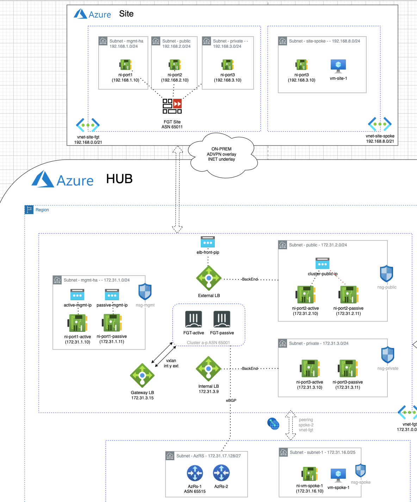

# Forigate cluster deployment
## Introduction

This deployment will create two Fortigate Clusters Active/Passive in two zones and with 3 ports (Management-HA, Public and Private), one acting as HUB and other acting as SDWAN spoke connected to HUB. 

Note: it is possible to configure mangement and HA sync port since within some interface since version 7.0.2

## Deployment Overview

- New VNet with necessary subents: Management (MGMT), Public and Private
- Fortigate cluster: 2 instances with 4 interfaces in active-passive cluster FGCP.
- Load Balancer (LB) sandwich deployment, one LB for frontend and another for backend communications.
- HA failover is handeled by LB

## Diagram overview

## Requirements
* [Terraform](https://learn.hashicorp.com/terraform/getting-started/install.html) >= 1.0.0
* Check particulars requiriments for each deployment (Azure) 

## Deployment
* Clone the repository.
* Configure accesss secrets to access AWS in terraform.tfvars.example which is allocated in root folder. [terraform.tfvars.example](./terraform.tfvars.example).  And rename `terraform.tfvars.example` to `terraform.tfvars`.
* Change parameters in the variables.tf.
* If using SSO, uncomment the token variable in variables.tf and providers.tf
* Initialize the providers and modules in each individual deployment as is described in it README file.

# Support
This a personal repository with goal of testing and demo Fortinet solutions on the Cloud. No support is provided and must be used by your own responsability. Cloud Providers will charge for this deployments, please take it in count before proceed.

## License
[License](./LICENSE)

