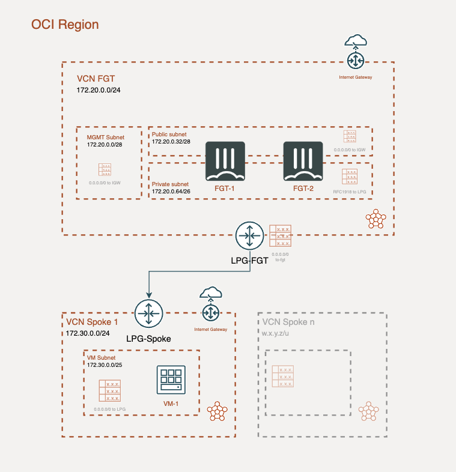

# Forigate cluster deployment
## Introduction

This deployment will create a Fortigate Cluster Active/Passive in two Availability Domains (AD1 and AD2) and with 3 ports (Management-HA, Public and Private). (It is possible to deploy sharing mangement port and HA sync port since version 7.0.2)

## Deployment Overview

- New VCN with necessary regional subnets: Management (MGMT), Public and Private.
- New VCN spoke with one regional subnet for new test instance peered with FGT VCN.
- Fortigate cluster: 2 instances with 3 interfaces in active-passive cluster FGCP.
- HA failover is handeled by Fortigate SDN connector, which will update public IP asignations and necessary route tables

## Diagram overview

## Requirements
* [Terraform](https://learn.hashicorp.com/terraform/getting-started/install.html) >= 1.0.0
* Check particulars requiriments for each deployment (Azure) 

## Deployment
* Clone the repository.
* Configure accesss secrets to access OCI in terraform.tfvars.example which is allocated in root folder. [terraform.tfvars.example](./terraform.tfvars.example).  And rename `terraform.tfvars.example` to `terraform.tfvars`.
* Change parameters in the variables.tf.
* If using SSO, uncomment the token variable in variables.tf and providers.tf
* Initialize the providers and modules in each individual deployment as is described in it README file.

# Support
This a personal repository with goal of testing and demo Fortinet solutions on the Cloud. No support is provided and must be used by your own responsability. Cloud Providers will charge for this deployments, please take it in count before proceed.

## License
[License](./LICENSE)

